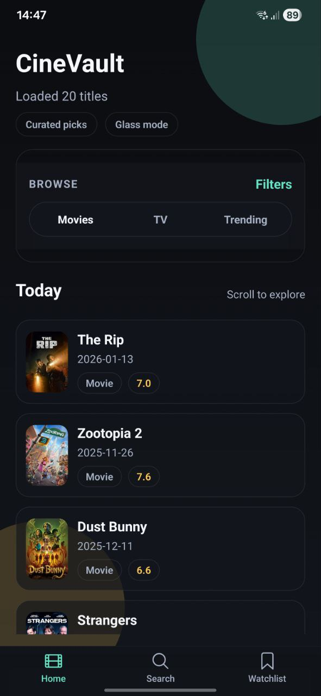
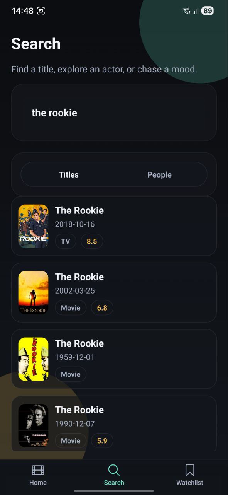
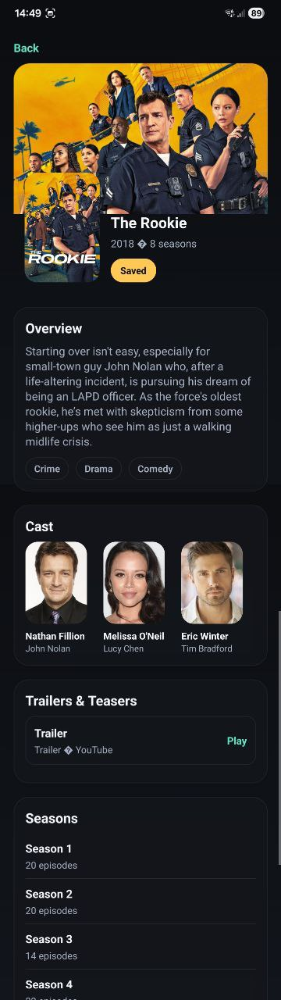
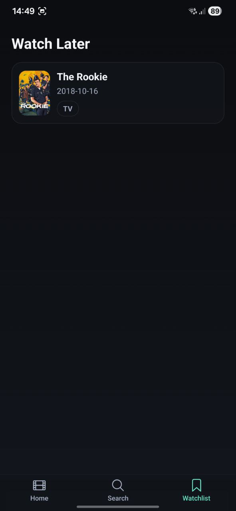

# Movies App

A sleek Expo + React Native movies app that lets you discover films, explore details, and build a watchlist. Built with a clean UI theme and fast navigation.

## What it can do
- Browse trending and popular movies
- Search for titles instantly
- View rich details (overview, ratings, genres, runtime, and more)
- Save movies to a personal watchlist
- Smooth navigation across Home, Search, Details, and Watchlist screens

## Screenshots
Placeholders below use images from `assets/`. Swap or add more as needed.

### Home


### Search


### Details


### Watchlist


## Tech stack
- Expo + React Native
- React Navigation
- AsyncStorage for local watchlist
- TMDB API for movie data

## Getting started
1) Install dependencies:
   ```bash
   npm install
   ```
2) Create your env file:
   ```bash
   cp .env.example .env
   ```
3) Add your TMDB token in `.env`:
   ```env
   EXPO_PUBLIC_TMDB_READ_TOKEN=your_token_here
   EXPO_PUBLIC_TMDB_IMAGE_BASE=https://image.tmdb.org/t/p
   ```
4) Start the app:
   ```bash
   npm run start
   ```

## Scripts
- `npm run start` — start Expo dev server
- `npm run android` — run on Android
- `npm run ios` — run on iOS
- `npm run web` — run on web

